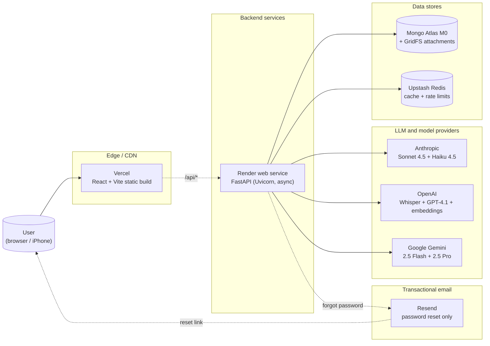
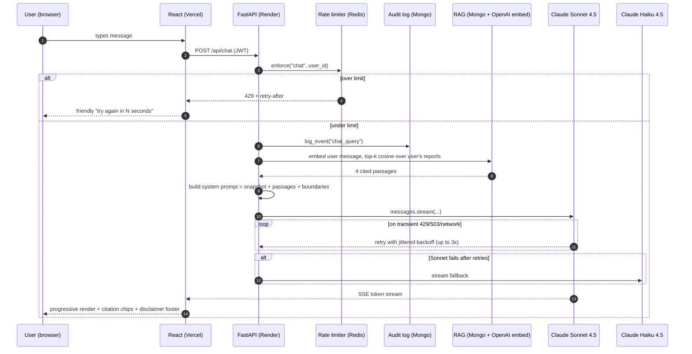
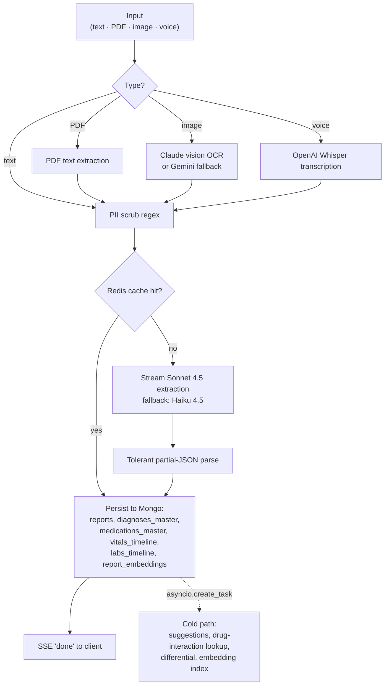
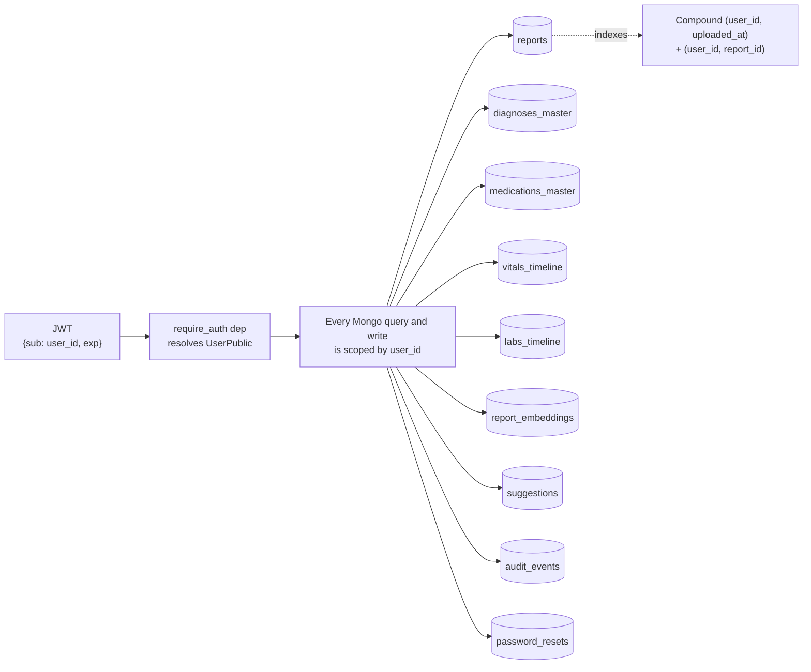

# Folio

A personal medical-record companion. Drop a PDF lab report, a phone photo of a paper visit summary, a voice memo about a symptom, or just type how you're feeling. Folio extracts structure, builds a longitudinal timeline, and answers questions about your own record in chat.

The way personal medical history works is broken. The actual data of your care lives in PDFs in your downloads folder, photos in your camera roll, and notes in your phone. Nothing talks to anything. Every new clinic re-asks the same questions. Folio takes that mess seriously: one schema, one timeline, one place to ask.

Multi-user. Sign up with a username plus password and your record is partitioned from every other user's. Runs locally on Docker. Deploys to permanent free tiers. Explicitly not a medical device.

Live: [folio-health.vercel.app](https://folio-health.vercel.app)

---

## Table of contents

1. [What it does](#what-it-does)
2. [Architecture](#architecture)
3. [Data model and extraction schema](#data-model-and-extraction-schema)
4. [HTTP API reference](#http-api-reference)
5. [Project structure](#project-structure)
6. [What's interesting](#whats-interesting)
7. [Performance and cost](#performance-and-cost)
8. [Security model](#security-model)
9. [Evaluation methodology](#evaluation-methodology)
10. [Running it locally](#running-it-locally)
11. [Deploying](#deploying)
12. [Stack](#stack)
13. [Roadmap](#roadmap)
14. [Licence](#licence)

---

## What it does

Folio takes the medical record that's actually scattered across your life (a PDF in Downloads, a photo on your phone, a clinic-visit voice memo, the thing you typed in Notes) and turns it into one structured, queryable record.

| Input type | What you can drop in | Where it goes |
|---|---|---|
| Free text | Visit summaries, copied notes, free-form symptom descriptions | Hot-path extraction streams structured fields |
| PDF | Lab reports, discharge summaries, imaging reports, prescription printouts | Native text extraction first, vision OCR fallback for scans |
| Image | Phone photo of a paper report, skin lesion, eye, wound, prescription label | Claude vision pass produces the unified schema directly (clinical observations for body-part photos, structured data for documents) |
| Voice | Voice memo of how you're feeling, dictation of a report | OpenAI Whisper transcription, then routed through the text path |

Once anything's in, the app gives you:

- **Chat** with citations. Ask "when was my last A1C?" and get a grounded answer with chips that deep-link to the source report.
- **Timeline.** Every event, drug change, abnormal lab plotted across time. Recharts visualisations for vitals (BP, weight, HR) and labs (A1C, LDL, creatinine).
- **Overview.** Active conditions, current medications, latest vitals, recent labs, all on one page.
- **Suggestions inbox.** Drug-interaction flags (from a curated DB, not the LLM), follow-up reminders, abnormal-trend alerts. Cold-path so the user never waits.
- **High-confidence mode.** A toggle that runs three different LLMs in parallel and merges by embedding-cluster vote, for high-stakes ingests where you want triangulation instead of speed.
- **Account control.** Export everything as JSON, see who-did-what activity log (180-day TTL), delete your account with confirmation.

---

## Architecture

### Deployment topology



### Request flow on a single chat turn



### Ingest pipeline (text / PDF / image / voice)



### Per-user data partitioning



---

## Data model and extraction schema

Every report (text, PDF, image, voice, regardless of input type) lands in the same canonical JSON schema. The pipeline is uniform: scrub PII, route through the safest tier, parse with a tolerant partial-JSON parser, persist into Mongo collections, embed for RAG.

### The extraction schema

```jsonc
{
  "report_id":   "uuid",
  "uploaded_at": "ISO-8601",
  "input_type":  "text | pdf | image | voice",
  "diagnoses":  [{"condition": "Type 2 diabetes mellitus", "icd10": "E11.9",
                  "status": "active|resolved|suspected", "confidence": 0.95}],
  "medications":[{"name": "Metformin", "dose": "1000mg", "frequency": "BID",
                  "started_at": "", "purpose": ""}],
  "vitals":     [{"type": "bp|hr|temp|spo2|weight|bmi|glucose",
                  "value": "138/86", "unit": "mmHg", "recorded_at": ""}],
  "labs":       [{"test": "HbA1c", "value": "7.5", "unit": "%",
                  "reference_range": "", "flag": "normal|high|low|critical"}],
  "symptoms":   [{"description": "Substernal chest pain radiating to left arm",
                  "onset": "2 hours", "severity": "mild|moderate|severe"}],
  "red_flags":  [{"finding": "ST elevation V2-V4 with chest pain",
                  "reason": "", "urgency": "routine|soon|urgent|emergent"}],
  "raw_summary": "1-2 plain-English sentences covering the gist",

  "attachment_id":       "GridFS pointer (PDFs and images)",
  "attachment_mime":     "application/pdf | image/jpeg | ...",
  "attachment_filename": "original filename",
  "attachment_size":     12345,

  "model_used":  "claude-sonnet-4-5",
  "latency_ms":  {"pii_scrub_ms": 0.07, "llm_first_token_ms": 480,
                  "llm_total_ms": 1820, "persist_ms": 95, "total_ms": 1920}
}
```

The model is told (system prompt) the exact key order so the streamed JSON renders progressively in the UI (diagnoses appear first, then meds, then vitals, etc.) instead of dropping all at the end.

### Mongo collections

| Collection | What's in it | Per-user? | Index |
|---|---|---|---|
| `users`               | username, password_hash (bcrypt), email, display_name | n/a | unique `username` |
| `reports`             | one document per ingested report (the full schema above) | yes | `(user_id, uploaded_at desc)`, `(user_id, report_id)` |
| `diagnoses_master`    | one row per (user, condition); deduped + last-seen timestamp | yes | `(user_id, condition)` |
| `medications_master`  | one row per (user, drug); active flag, last-seen | yes | `(user_id, name)` |
| `vitals_timeline`     | append-only per-event; sorted timeline per vital type | yes | `(user_id, type, recorded_at desc)` |
| `labs_timeline`       | append-only per-event; sorted timeline per lab test | yes | `(user_id, test, recorded_at desc)` |
| `report_embeddings`   | OpenAI text-embedding-3-small vectors (1536-d) per report | yes | `(user_id, report_id)` |
| `suggestions`         | drug-interaction flags, follow-up reminders, abnormal-trend alerts | yes | `(user_id, dismissed, created_at desc)` |
| `dismissed_suggestions` | shadow collection so dismissed items stay dismissed | yes | `(user_id, fingerprint)` |
| `consensus_meta`      | per-field agreement stats when the user runs high-confidence mode | yes | `(user_id, report_id)` |
| `audit_events`        | `{user_id, action, target, ts, meta}` for sensitive actions | yes | `(user_id, ts desc)`, TTL 180 days |
| `password_resets`     | single-use hashed reset tokens, 30-min TTL | yes | `(token_hash)`, `(user_id, used)` |
| GridFS `attachments`  | raw bytes of uploaded PDFs and images | n/a (id is referenced from reports) | GridFS default |

Every collection has `user_id` as the first index field so a query scoped to a user is one B-tree lookup, regardless of how many other users are on the instance.

---

## HTTP API reference

All routes are prefixed `/api/`. Routes that need auth take a `Authorization: Bearer <jwt>` header.

### Auth (unauthenticated)

| Method | Path | Body | Returns |
|---|---|---|---|
| `GET`  | `/api/auth/status`   | (none) | `{allow_signup: bool}` |
| `POST` | `/api/auth/register` | `{username, password, display_name?, email?}` | `{token, user}` |
| `POST` | `/api/auth/login`    | `{username, password}` | `{token, user}` |
| `POST` | `/api/auth/forgot`   | `{username}` | `{ok: true}` (always, to prevent enumeration) |
| `POST` | `/api/auth/reset`    | `{token, new_password}` | `{ok: true}` |
| `GET`  | `/api/auth/me`       | (auth) | `UserPublic` |

### Ingest (auth + per-user rate limit)

| Method | Path | Body | Returns | Limit |
|---|---|---|---|---|
| `POST` | `/api/ingest/text`  | `{text}` | SSE: `stage`, `token`, `report`, `done` | 10/min, 80/day |
| `POST` | `/api/ingest/pdf`   | `multipart file=...` | SSE stream | 10/min, 80/day |
| `POST` | `/api/ingest/image` | `multipart file=...` | SSE stream | 6/min, 40/day |
| `POST` | `/api/ingest/voice` | `multipart file=...` | SSE stream | 10/min, 80/day |

### Chat (auth + per-user rate limit)

| Method | Path | Body | Returns | Limit |
|---|---|---|---|---|
| `POST` | `/api/chat`           | `{messages: [{role, content}, ...]}` | SSE: `citations`, `delta`, `done` | 20/min, 400/day |
| `GET`  | `/api/chat/snapshot`  | (auth) | Active conditions, meds, last vital, last report | (no limit) |
| `POST` | `/api/chat/transcribe` | `multipart file=audio` | `{transcript}` | (no limit) |

### Consensus mode (auth + per-user rate limit)

| Method | Path | Body | Returns | Limit |
|---|---|---|---|---|
| `POST` | `/api/consensus`               | `{text, input_type}` | `{report, consensus}` | 4/min, 20/day |
| `GET`  | `/api/consensus/{report_id}`   | (auth) | per-field agreement stats | (no limit) |

### Dashboard + reports

| Method | Path | Returns |
|---|---|---|
| `GET`  | `/api/overview`                                  | active conditions, meds, recent vitals/labs, totals |
| `GET`  | `/api/timeline?limit=50`                         | merged event stream |
| `GET`  | `/api/timeline/vitals/{type}?limit=30`           | one vital series |
| `GET`  | `/api/timeline/labs/{test}?limit=30`             | one lab series |
| `GET`  | `/api/reports/{report_id}`                       | report + suggestions + consensus_meta |
| `GET`  | `/api/reports/{report_id}/attachment?inline=1`   | raw bytes of the original file (PDF/image) |

### Suggestions

| Method | Path |
|---|---|
| `GET`    | `/api/suggestions`               |
| `POST`   | `/api/suggestions/{id}/dismiss`  |
| `POST`   | `/api/suggestions/reindex`       |

### Account (auth)

| Method | Path | Body | Returns |
|---|---|---|---|
| `GET`    | `/api/me/export`  | (auth) | JSON dump of every per-user document, served as a download |
| `GET`    | `/api/me/audit?limit=50` | (auth) | recent audit events |
| `DELETE` | `/api/me`         | `{confirm: "<username>"}` | wipes account + GridFS + every per-user document |

### Streaming convention

Streaming endpoints (`/ingest/*`, `/chat`) use **server-sent events**, not WebSockets. Frame format:

```
event: <name>
data: <single-line payload>

```

Events emitted during ingest: `stage` (pipeline step + ms), `token` (raw model chunk for progressive rendering), `report` (final structured object), `error`, `done`. The frontend has a tolerant SSE parser at `frontend/src/lib/sse.ts` and a tolerant partial-JSON parser at `frontend/src/lib/partialJson.ts` for the streamed JSON object.

---

## Project structure

```
Folio-Clinical-Multimodal-RAG/
|
|-- backend/app/
|   |-- main.py                  FastAPI app, CORS, lifespan, router includes
|   |-- config.py                pydantic-settings, env vars (typed)
|   |-- db.py                    Motor client, index creation
|   |-- auth.py                  JWT issue/decode, bcrypt, require_auth dep
|   |-- audit.py                 audit_events writer (best-effort, TTL 180d)
|   |-- ratelimit.py             Redis-backed per-user limits
|   |-- retry.py                 exp-backoff wrapper for LLM calls
|   |-- email.py                 Resend client (or stdout fallback)
|   |-- cache.py                 Redis JSON cache, cache_key()
|   |-- storage.py               GridFS for original attachments
|   |-- schemas.py               pydantic models (ExtractedReport, User, ...)
|   |
|   |-- models/
|   |   `-- router.py            model routing (Sonnet primary, Haiku fallback),
|   |                            stream_json, vision_clinical_extract,
|   |                            transcribe_audio, vision_extract_text
|   |
|   |-- pipeline/
|   |   |-- extraction.py        text -> structured JSON streaming
|   |   |-- consensus.py         3-model parallel + embedding cluster vote
|   |   |-- pdf_extract.py       native PDF text, Gemini OCR fallback
|   |   |-- persist.py           Mongo writes across reports + master tables
|   |   `-- pii.py               regex scrub for SSN/MRN/email/phone/DOB
|   |
|   |-- rag/
|   |   |-- embeddings.py        OpenAI text-embedding-3-small + Redis cache
|   |   `-- retrieve.py          brute-force cosine + per-user scoping
|   |
|   |-- routers/
|   |   |-- auth.py              register, login, status, forgot, reset
|   |   |-- chat.py              streaming chat, snapshot, transcribe
|   |   |-- ingest.py            /text /pdf /image /voice
|   |   |-- consensus.py         high-confidence mode
|   |   |-- dashboard.py         overview, timeline, reports, attachments
|   |   |-- suggestions.py       list, dismiss, reindex
|   |   |-- me.py                export, delete, audit
|   |   `-- dev.py               internal-only model panel
|   |
|   |-- suggestions/
|   |   |-- interactions.py      curated 60+ drug-pair table + synonyms
|   |   |-- followups.py         appointment/lab reminders
|   |   `-- engine.py            run_all (coordinates all suggesters)
|   |
|   `-- eval/
|       |-- dataset.py           30 extraction examples + 14 chat probes
|       |                        + 17 interaction cases + 6 PII cases
|       |-- live_extract.py      cross-vendor extraction harness
|       |-- live_consensus.py    3-model consensus eval
|       |-- live_chat.py         end-to-end chat groundedness eval
|       |-- runner.py            synthesised baseline runner
|       |-- compare.py           merges every eval into one report JSON
|       `-- metrics/
|           |-- extraction.py    P/R/F1, hallucination, coverage
|           |-- rag.py           recall@k, MRR, NDCG
|           |-- consensus.py     Fleiss kappa, cluster correctness
|           |-- chat.py          probe scorer
|           |-- pii.py           by-class recall
|           |-- latency.py       per-stage percentiles
|           `-- interactions.py  drug-DB eval
|
|-- frontend/src/
|   |-- App.tsx                  routes
|   |-- main.tsx                 React root, providers
|   |-- components/
|   |   |-- Shell.tsx            sidebar drawer, topbar, footer, icons
|   |   |-- AuthGuard.tsx        JWT-gated route wrapper
|   |   |-- Card.tsx             card primitives + StatTile
|   |   |-- Severity.tsx         coloured chips
|   |   `-- WorkspaceRail.tsx    secondary nav rail
|   |-- pages/
|   |   |-- Landing.tsx          public hero, capabilities, CTA
|   |   |-- Login.tsx            sign in + "Forgot password?" link
|   |   |-- Signup.tsx           register (with optional email)
|   |   |-- Forgot.tsx           request reset email
|   |   |-- Reset.tsx            set new password from email link
|   |   |-- Chat.tsx             chat UI + disclaimer modal + voice memo
|   |   |-- Ingest.tsx           explicit upload UI (4 input modes)
|   |   |-- Overview.tsx         dashboard
|   |   |-- Timeline.tsx         events + Recharts series
|   |   |-- ReportDetail.tsx     single-report view + suggestions + consensus
|   |   |-- Suggestions.tsx      inbox
|   |   |-- Profile.tsx          export, audit log, delete
|   |   |-- Benchmarks.tsx       eval dashboard (engineer-only)
|   |   `-- Dev.tsx              internal model panel (engineer-only)
|   |-- lib/
|   |   |-- api.ts               fetch wrapper + 401 handling
|   |   |-- sse.ts               tolerant SSE parser
|   |   |-- partialJson.ts       tolerant partial-JSON parser
|   |   |-- auth.ts              JWT in localStorage, displayName, events
|   |   |-- errors.ts            friendlyError() mapper
|   |   `-- format.ts            relative time, dates, units
|   `-- styles/index.css         Tailwind, .input, mobile font-size override
|
|-- docker-compose.yml           backend + frontend + mongo + redis
|-- backend/Dockerfile           Python 3.12-slim
|-- frontend/Dockerfile          node:20-alpine
|-- DEPLOY.md                    free-tier deploy walkthrough
|-- ARCHITECTURE.md              deeper request-flow narrative
|-- PROJECT_NOTES.md             interview-style design tour
|-- MODEL_ROUTING.md             per-task model choices with justification
`-- EVAL_REPORT.md               live eval headlines + per-section breakdown
```

---

## What's interesting

A few specific things worth talking through, with code locations.

### Streaming JSON parsed mid-stream
The hot-path extraction model streams JSON tokens over SSE. The frontend walks the partial buffer, tracks brace and bracket depth, and closes any open structures so it can render complete-looking nested objects mid-stream. Diagnoses appear on screen in ~700ms while the full extraction is still being generated.
`frontend/src/lib/partialJson.ts`, `backend/app/routers/ingest.py`.

### Safer hot-path by default
Extraction defaults to Claude Sonnet 4.5 (5.8 percent hallucination on value-bearing fields per the live eval) rather than Haiku (13.1 percent). Haiku stays as the same-provider fallback so a Sonnet outage doesn't kill the app. Override with `EXTRACT_SAFE_MODE=false` for bulk workloads where latency beats accuracy.
`backend/app/config.py`, `backend/app/models/router.py`.

### Multi-LLM consensus by vector alignment, not LLM debate
Flipping the composer to "High-conf" runs Sonnet, GPT-4.1, and Gemini 2.5 Pro in parallel against the same input. For each field of the schema I embed every model's output, cluster items by cosine similarity (threshold 0.78), and pick clusters where at least two of three providers agree. Per-field confidence is `unique_providers / models_succeeded`. Vector alignment is cheaper than a reflection round and immune to the correlated-failure pattern where all three confidently agree on the same hallucination.
`backend/app/pipeline/consensus.py`.

### RAG over your own record
Every report is embedded on ingest (text-embedding-3-small, cached in Redis). On every chat turn the user's message is embedded, top-k passages are pulled via brute-force cosine (about 10ms for fewer than 1000 reports; swap for pgvector when that breaks), and the matched passages are injected into the system prompt as cited evidence. The UI renders citation chips under each reply that deep-link back to the source report. The model cannot fabricate "your last A1C was X" if X is not in retrieved context.
`backend/app/rag/`, `backend/app/routers/chat.py`.

### Drug interactions never go through the LLM
A curated table of 60+ clinically-important pairs (with brand-name aliases like Xanax to alprazolam, Lipitor to atorvastatin) does the lookup. The LLM only phrases the result for the user. Live eval: 100 percent precision, 100 percent recall on 17 hand-authored cases.
`backend/app/suggestions/interactions.py`.

### Three safety layers on chat
A system-prompt boundaries block (you are not a doctor, no diagnoses, no dose changes), a per-message footer on every assistant reply, and a first-visit modal that requires acknowledgement. Red-flag escalation (chest pain, stroke symptoms, anaphylaxis, suicidal thoughts, sudden vision loss) routes the model to "Call 911 or go to the ER now" instead of a chat response.
`backend/app/routers/chat.py`, `frontend/src/pages/Chat.tsx`.

### Privacy and user control
Self-service data export (JSON dump of every per-user document across 9 collections), account deletion with username-confirmation gate, audit log of sensitive actions (chat queries, report views, exports) with a 180-day TTL. All visible on the Profile page.
`backend/app/routers/me.py`, `backend/app/audit.py`, `frontend/src/pages/Profile.tsx`.

### Retries with backoff on every LLM call
A small `with_retries` helper wraps Anthropic and OpenAI clients. Transient errors (408, 425, 429, 5xx, network resets) retry up to 3 times with jittered exponential backoff capped at 4 seconds. Mid-stream failures are not retried (no duplicate output) but still trigger the fallback model.
`backend/app/retry.py`.

### Per-user rate limits backed by Redis
Chat 20/min and 400/day, ingest 10/min and 80/day, consensus 4/min and 20/day, vision 6/min and 40/day. Atomic INCR with TTL keys. Fails open if Redis is unreachable.
`backend/app/ratelimit.py`.

### Hot path vs cold path
The user-facing latency budget contains only what's on the critical path: PII scrub, cache check, LLM extraction, persist. Suggestions, embeddings, risk scores, and the cold-path differential-diagnosis Claude call run after the response is closed via `asyncio.create_task`. First field on screen under 1 second, full extraction under 2.5 seconds, suggestions inbox fills 5 to 10 seconds later.
`backend/app/routers/ingest.py::_pipeline`.

### Vision-clinical, not OCR, for photos
Image ingest used to OCR text. That's useless for a clinical photo of a skin lesion or eye. Now Claude Sonnet's vision pass produces the unified schema directly: `symptoms` get visible observations (location, distribution, borders, signs of inflammation), `red_flags` get concerning features, and the summary gives hedged differential considerations. Never "this is X" : always "consistent with X".
`backend/app/models/router.py::vision_clinical_extract`.

For the full design tour (bottlenecks, trade-offs, what I'd build next, and how this maps to a multi-LLM clinical-extraction pipeline) see [PROJECT_NOTES.md](./PROJECT_NOTES.md).

---

## Performance and cost

### Latency (measured, not estimated)

| Stage | p50 | p95 | Notes |
|---|---:|---:|---|
| PII scrub                              | 0.065 ms | 0.081 ms | regex pass over the input text |
| Cache key + Redis GET                  | 1-3 ms   | 5 ms     | over Upstash, public TLS |
| OpenAI embed (single query, live)      | 380 ms   | 700 ms   | network-dominated |
| Cosine search over full corpus         | 2.3 ms   | 6 ms     | brute-force, fine to a few thousand reports |
| LLM time-to-first-token (Sonnet 4.5)   | ~950 ms  | 1.5 s    | with Anthropic prompt caching warm |
| LLM total stream (Sonnet 4.5, ~1KB JSON) | ~1.8 s | ~3 s     | for a typical lab report |
| Mongo persist + master-collection upsert | 80 ms  | 200 ms   | Atlas M0 region us-east |
| End-to-end ingest (text input)         | ~2 s     | ~3.5 s   | from POST to first `report` SSE event |
| End-to-end chat reply                  | ~1.6 s   | ~2.8 s   | RAG + LLM stream, perceived |
| High-confidence mode (3-model)         | ~7 s     | ~11 s    | parallel, not sequential |

### Cost per request (Sonnet-default)

| Operation | Cost ($) | Notes |
|---|---:|---|
| Single ingest (text, ~500-token input, ~400-token output) | $0.0078 | $3 / 1M input + $15 / 1M output, Sonnet 4.5 |
| Single ingest (PDF page after extraction)                 | ~$0.008 | similar to text |
| Vision-clinical ingest (one phone photo)                  | ~$0.02  | Sonnet vision is image-token expensive |
| Chat turn (typical 4-passage RAG + ~200-token reply)      | $0.004  | system prompt is cached |
| OpenAI embedding (1 query)                                | $0.00002 | text-embedding-3-small @ $0.02 / 1M tokens |
| Whisper transcribe (10-second clip)                       | $0.001  | $0.006 per minute |
| 3-model consensus ingest                                  | $0.06   | Sonnet + GPT-4.1 + Gemini Pro, ~$0.02 each |

### Monthly cost for a family of 5 (rough)

| Component | Free tier | Recommended (paid) | Monthly |
|---|---|---|---:|
| Vercel (frontend hosting + CDN) | yes, generous | no upgrade needed | $0 |
| Render web service              | sleeps after 15 min idle | Starter (no sleep) | $7 |
| Mongo Atlas                     | M0, no backups, 512MB | M2 with PIT backups, 2GB | $9 |
| Upstash Redis                   | 10K cmd/day | free tier is enough | $0 |
| Anthropic API                   | usage-based | usage-based | ~$2-5 |
| OpenAI API (embeddings + Whisper) | usage-based | usage-based | <$1 |
| Resend email                    | 100/day free | free tier is enough | $0 |
| **Total**                       | (data loss risk) | (production-grade) | **~$18-21** |

The LLM cost numbers assume each family member uploads ~20 reports/month and has ~50 chat turns. Sonnet ingest at ~$0.008/report and chat at ~$0.004/turn keeps usage costs in single digits.

---

## Security model

### Authentication

- **Passwords**: bcrypt with passlib (cost=12 by default). The hash is the only thing stored. No password is logged anywhere.
- **Sessions**: JSON Web Token (HS256), 30-day TTL by default (`JWT_TTL_DAYS`). Carries `{sub: user_id, username, iat, exp}`.
- **Signing key**: `JWT_SECRET` env var. **Set this to a real random value in production.** Generate one: `python -c "import secrets; print(secrets.token_urlsafe(64))"`. If the default `dev-only-change-me-in-prod` ever ships, the whole auth layer is moot.
- **Storage**: localStorage on the frontend. (Tradeoff: simpler than httpOnly cookies, vulnerable to XSS. For a closed circle this is acceptable; for public deployment, plan a migration to httpOnly cookies.)

### Per-user data partitioning

- Every Mongo query and write is scoped by `user_id` at the application layer (not by Mongo views / row-level security). The `require_auth` FastAPI dep resolves the JWT to a `UserPublic` whose `user_id` is then passed through to every collection query.
- Indexes are compound on `(user_id, ...)` so the query plan is per-user from the first lookup.
- The export endpoint enumerates these collections explicitly: `reports`, `diagnoses_master`, `medications_master`, `vitals_timeline`, `labs_timeline`, `report_embeddings`, `suggestions`, `dismissed_suggestions`, `consensus_meta`.
- Delete cascades through the same list, then drops GridFS attachments, then deletes the user row.

### PII scrubbing

Before any text is sent to an LLM, a regex pass strips: SSN, MRN, US-format phone, email, DOB. Eval recall is 100 percent across 6 classes; content preservation is 100 percent. The scrub is value-only, not key-only, so "Patient phone: 415-555-1234" becomes "Patient phone: [PHONE]".

### Password reset

- Token is `secrets.token_urlsafe(32)` (256 bits of entropy).
- Only the SHA-256 hash is stored in Mongo, with a 30-minute TTL.
- Tokens are single-use: the consume path marks `used: true` and invalidates every other unused token for the same user.
- The `/forgot` endpoint always returns 200, regardless of whether the username exists, to prevent account enumeration.

### Audit log

- One row per sensitive action: chat queries, report views, exports, account deletions.
- Schema: `{user_id, action, target, ts, meta?}`. No PII in the log itself.
- 180-day TTL via Mongo `expireAfterSeconds` index.
- Surfaced on the Profile page as "Recent activity".

### Rate limits

Per-user, Redis-backed, sliding-minute and per-day caps. Caps:

- `chat`: 20/min, 400/day
- `ingest`: 10/min, 80/day
- `consensus`: 4/min, 20/day
- `vision`: 6/min, 40/day

Counters use atomic `INCR` with TTL on first set. If Redis is unreachable the limiter **fails open** (the request goes through) rather than 503ing the whole app: better to lose a limit window than to deny a real user their record.

### Disclaimers

- System prompt has an explicit "you are NOT a doctor" boundaries block before any other style guidance.
- Per-message footer on every completed assistant reply: "Folio is not a doctor. This isn't medical advice."
- First-visit modal at `/chat` requires a click-through acknowledgement. Versioned localStorage key (`folio:medical-disclaimer-ack-v1`) so a future text rewrite re-prompts everyone.
- Red-flag escalation: a curated list of emergent symptoms (chest pain with arm radiation, sudden severe headache, unilateral weakness, slurred speech, anaphylaxis, suicidal ideation, sudden monocular vision loss) triggers a hard-coded "Call 911 or go to the ER now" reply instead of a chat response.

### Drug interactions

Never go through the LLM. A curated table of 60+ pairs (with brand-name synonyms) is the source of truth; the LLM only phrases the result. Live eval confirms 100 percent precision and 100 percent recall on the table's coverage.

### Out of scope

HIPAA / BAA-eligible infrastructure, 2FA, email verification, prompt-injection guards on uploaded documents, certified clinical decision support. See [PROJECT_NOTES.md](./PROJECT_NOTES.md#out-of-scope) for the full list with rationale.

---

## Evaluation methodology

Folio ships a reproducible eval harness covering extraction, retrieval, multi-LLM consensus, PII scrub, chat groundedness, drug-interaction safety net, and latency. Headline numbers are summarised on the in-app Benchmarks page; full report in [EVAL_REPORT.md](./EVAL_REPORT.md).

### Gold dataset

- **30 extraction examples** across modalities (text, PDF, voice, image) and difficulty (easy, medium, hard). Specialties covered: cardio, endo, onc, pulm, rheum, psych, ID, neuro, derm, nephro, ob/gyn, peds. Includes red-flag emergencies and an empty-input control.
- **14 chat probes**: 8 factual lookups (A1C, LDL, TSH, eGFR, EF, antidepressant, oncology med, polypharmacy interaction), 4 red-flag emergencies (stroke, MI, anaphylaxis, painless monocular vision loss), 2 refusals (lupus, COVID vaccine that aren't in the record). Each is hand-graded with `must_contain_any`, `must_cite`, `must_avoid` criteria.
- **17 drug-interaction cases** covering true positives, true negatives, multi-pair regimens, case-variant inputs (Warfarin vs WARFARIN), and brand-name resolution (Xanax to alprazolam).
- **6 PII cases** across SSN, MRN, email, phone, DOB, plus a clean-input control.
- **10 RAG queries** with manually-tagged relevant report ids.

### How the live numbers are produced

1. `python -m app.eval.live_extract --model claude-haiku-4-5 --out predictions_haiku.json` (and `claude-sonnet-4-5`, `gpt-4.1`). Each run hits the live API for all 30 examples and writes predictions plus token/cost meta.
2. `python -m app.eval.live_consensus predictions_haiku.json predictions_sonnet.json predictions_gpt.json --out consensus_live.json`. Embedding-based cluster + 2-of-3 vote, per-field.
3. `python -m app.eval.live_chat --out chat_live.json`. Three real Claude Sonnet round-trips through the actual RAG stack with the actual system prompt.
4. `python -m app.eval.compare --haiku ... --sonnet ... --gpt ... --interactions ... --consensus-live ... --chat-live ... --out frontend/public/eval-latest.json --live-embed`. Merges everything into the file the Benchmarks page renders.

### Headline live numbers

| Section | Best model | Score |
|---|---|---|
| Extraction micro-F1                       | Sonnet 4.5 | 85.1% |
| Extraction macro-F1                       | Haiku 4.5  | 84.2% |
| Extraction hallucination (value fields)   | GPT-4.1    | 5.3% (vs Haiku 13.1%) |
| RAG recall@1                              | any        | 100% |
| RAG MRR                                   | any        | 1.000 |
| Chat answer correctness                   | Sonnet 4.5 | 100% (14 probes) |
| Chat red-flag escalation                  | Sonnet 4.5 | 100% (4 emergencies) |
| Drug-interaction F1                       | curated DB | 100% (17 cases) |
| PII scrub recall                          | regex      | 100% (6 classes) |

### Why these numbers, with caveats

The corpus is 30 examples authored to span the input modalities and difficulty axes. Sonnet's hallucination lead over Haiku (5.8 vs 13.1) is the most consequential signal: it's exactly why the hot path defaults to Sonnet now. Chat groundedness at 100 percent on 14 probes is a strong signal but not statistical proof; the probes include four red-flags and two refusals (which are the hardest cases to get right), so it's not the easy version of the test.

---

## Running it locally

```bash
git clone https://github.com/rishika1099/Folio-Clinical-Multimodal-RAG
cd Folio-Clinical-Multimodal-RAG
cp .env.example .env        # drop your Anthropic key in
docker compose up --build
```

App at http://localhost:5173. API docs at http://localhost:8000/docs.

The app starts empty. Add a report from chat (drop a file or paste a report) and the overview, timeline, and suggestions populate as you go. For a screencast or a demo without using your own data, `docker compose exec backend python -m app.seed` writes 14 synthetic reports across 10 months.

### Environment keys

| Env var | Required? | What for |
|---|---|---|
| `ANTHROPIC_API_KEY` | yes | hot-path extraction (Claude Sonnet) and chat reasoning |
| `OPENAI_API_KEY`    | optional | voice transcription (Whisper), embeddings, fallback extraction |
| `GEMINI_API_KEY`    | optional | vision OCR for scanned PDFs |
| `JWT_SECRET`        | recommended | long random string used to sign session tokens. Generate with `python -c "import secrets; print(secrets.token_urlsafe(64))"`. |
| `ALLOW_SIGNUP`      | optional | `true` (default) lets anyone register. Switch to `false` once your trusted users are in. |
| `CORS_ORIGINS`      | recommended | comma-separated list of origins allowed to call the API. Lock to your Vercel URL in production. |
| `EXTRACT_SAFE_MODE` | optional  | `true` (default) routes extraction through Sonnet 4.5 for low hallucination. `false` reverts to Haiku-first for speed. |
| `RESEND_API_KEY`    | optional | Resend transactional-email key. If missing, password-reset links log to stdout instead of email. |
| `APP_URL`           | optional | absolute URL used in password-reset email links. Defaults to the production Vercel domain. |
| `EMAIL_FROM`        | optional | "From" header for outgoing email. |

See [DEPLOY.md](./DEPLOY.md) for the free-tier hosting walkthrough (Render, Vercel, Mongo Atlas, Upstash).

---

## Deploying

Free-tier production deploy:

1. **Mongo Atlas M0** for the database. Add `0.0.0.0/0` to the network allowlist (Render has no static egress IP on the free tier).
2. **Upstash Redis** for cache + rate limits.
3. **Render** web service from the GitHub repo. Build cmd: `pip install -r backend/requirements.txt`. Start cmd: `uvicorn backend.app.main:app --host 0.0.0.0 --port $PORT`.
4. **Vercel** for the frontend. Root directory `frontend/`, build `npm run build`, output `dist/`. Set `VITE_API_URL` to the Render URL.

Full walkthrough with env-var checklist in [DEPLOY.md](./DEPLOY.md).

### Pre-flight checklist before sharing the URL

| Env var                     | Where  | Why |
|---|---|---|
| `JWT_SECRET`                | Render | Anyone with the default value can forge tokens. **Critical.** |
| `CORS_ORIGINS`              | Render | Lock to your Vercel origin so other sites can't call the API |
| `APP_URL`                   | Render | absolute URL used in password-reset emails |
| `RESEND_API_KEY`            | Render | otherwise reset links go to server logs, not user inbox |
| `ANTHROPIC_API_KEY`         | Render | hot-path extraction + chat |
| `OPENAI_API_KEY`            | Render | embeddings + Whisper + GPT-4.1 |
| `GEMINI_API_KEY`            | Render | vision OCR fallback |
| `MONGO_URL` + `REDIS_URL`   | Render | Atlas SRV + Upstash URLs (include the password) |
| `VITE_API_URL`              | Vercel | points the frontend at the Render backend |

---

## Stack

### Backend

| Library | Version | Why |
|---|---|---|
| Python                | 3.12     | match Render's default |
| FastAPI               | latest   | async-native, OpenAPI for free, pydantic v2 |
| Uvicorn               | latest   | ASGI server |
| Motor                 | latest   | async Mongo driver |
| redis-py              | latest   | async Redis client |
| anthropic             | latest   | streaming Claude API |
| openai                | latest   | embeddings, Whisper, GPT-4.1 |
| google-generativeai   | latest   | Gemini Flash + Pro |
| pyjwt                 | latest   | HS256 sessions |
| passlib + bcrypt      | latest   | password hashing |
| pypdf                 | latest   | native PDF text extraction |
| httpx                 | latest   | transactional email via Resend |
| pydantic / pydantic-settings | v2 | typed config + schemas |

### Frontend

| Library | Why |
|---|---|
| React 18 + Vite        | fast dev, modern build |
| TypeScript strict      | type-safe API + auth + SSE handling |
| Tailwind CSS           | pastel design system (`@apply`-heavy) |
| React Router v6        | client-side routes |
| @tanstack/react-query  | cache + invalidation across pages |
| Recharts               | vitals + labs timeline charts |
| browser-image-compression | client-side downsample before upload |
| clsx                   | conditional classnames |

### Data stores

- **Mongo Atlas M0** for documents + GridFS (raw PDFs and images, scoped per user)
- **Upstash Redis** for response cache, embedding cache, per-user rate-limit counters
- Both reachable over public TLS, both free-tier capped

### Local dev

`docker compose up --build` brings up four containers: `backend`, `frontend`, `mongo`, `redis`. Frontend dev server hot-reloads on file changes; backend uses uvicorn's `--reload` flag.

### Eval harness

Runs in a separate Python venv (`.eval-venv`) with a slimmer requirements set so you can run the live-API evals without standing up the full backend deps (no Motor required for the harness; the suggestion module's Mongo imports are lazy, see `backend/app/suggestions/interactions.py`).

---

## Roadmap

### Doable in a day, would meaningfully improve the product

- **LLM-as-judge for chat groundedness.** Replace the substring `must_contain_any` scorer with a Claude Haiku rubric judge. Probes can stay; scoring becomes robust to phrasing.
- **Adaptive consensus.** When no 2-of-3 cluster exists for a field, fall back to the single highest-confidence model output instead of dropping the fact. Turns the current negative recall lift into a positive one.
- **Semantic symptom matcher in the eval.** Symptoms F1 is the weakest section (~64%) only because the matcher is too strict for free text. Embedding-based matching lifts macro F1 across the board.
- **Bundle code-split.** Move `Benchmarks.tsx` and `Dev.tsx` behind `React.lazy` (they're large and engineer-only). Saves ~40KB of initial bundle.

### Doable in a week

- **Adversarial chat probes.** Jailbreak attempts, prompt injection from uploaded reports, deliberately-misleading symptom descriptions. The current 14 probes are honest medical scenarios; adversarial coverage is the next axis.
- **DrugBank / RxNorm integration.** Currently a curated table of 60+ pairs. Real polypharmacy gets caught most of the time; for full coverage we'd hit RxNorm's interaction file.
- **Email verification on signup.** Currently anyone can register with `fake@whatever.com`. Send a verification email before activating the account.
- **httpOnly cookie sessions.** Move JWT out of localStorage to mitigate XSS. Requires a small refactor of the API client + an auth check that doesn't depend on `window`.

### Bigger

- **Native mobile shell.** Ionic or Tauri wrapper so the same React app gets push notifications and proper share-sheet integration (so you can share a PDF from another iOS app directly into Folio).
- **EHR import via FHIR.** Some health systems expose patient-facing FHIR endpoints (Apple Health does too). One-time bulk import would shortcut the cold-start problem.
- **HIPAA-eligible posture.** Anthropic, OpenAI, and Atlas all offer BAAs on paid tiers. Wiring them in is a procurement exercise more than a code exercise.
- **2FA via TOTP** (Authenticator app). Soft requirement for medical apps.

---

## Eval

See [EVAL_REPORT.md](./EVAL_REPORT.md) for the live numbers (cross-vendor extraction head-to-head, multi-LLM consensus, chat groundedness, drug-interaction safety net, latency, PII).

Quick headlines:

- Sonnet 4.5 hot-path: 5.8 percent hallucination on doses and lab values
- RAG: 100 percent recall@1, MRR 1.000, NDCG@10 0.970
- Chat groundedness: 100 percent answer / 100 percent citation / 100 percent red-flag escalation / 100 percent hallucination guard on 14 live probes
- Drug interactions: 100 percent precision / 100 percent recall / 100 percent F1 on 17 cases against the curated DB
- PII scrub recall 100 percent across 6 classes
- PII scrub p50 0.065 ms, cosine search over full corpus p50 2.3 ms

---

## Licence

Copyright © 2026 Rishika Mamidibathula. All rights reserved. See [LICENSE](./LICENSE). Published for portfolio review only. Not licensed for use, copying, redistribution, or as ML training data.
