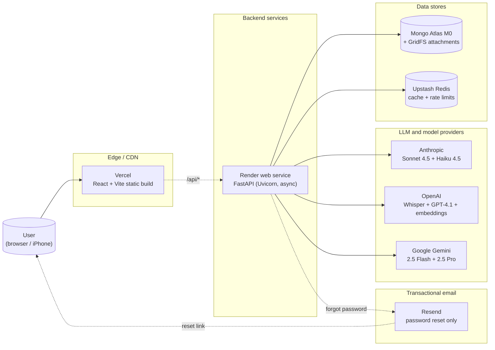
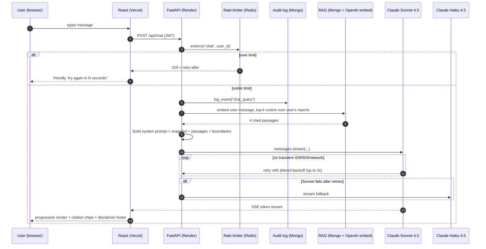
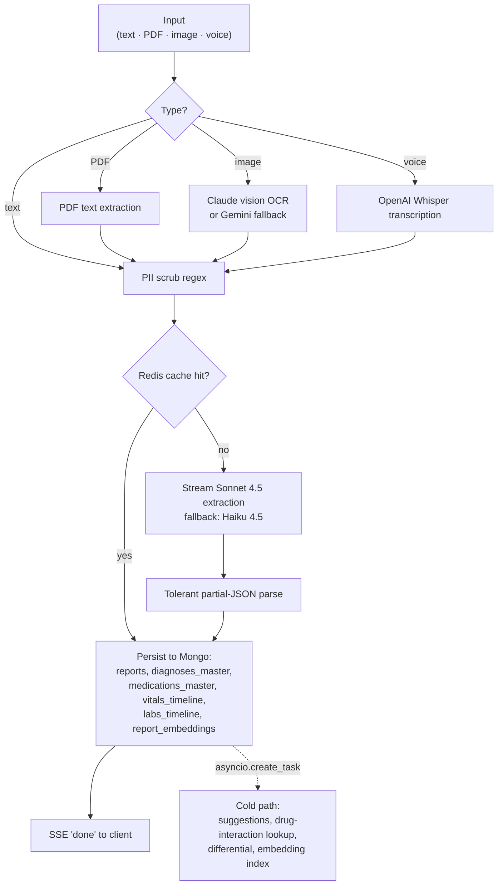
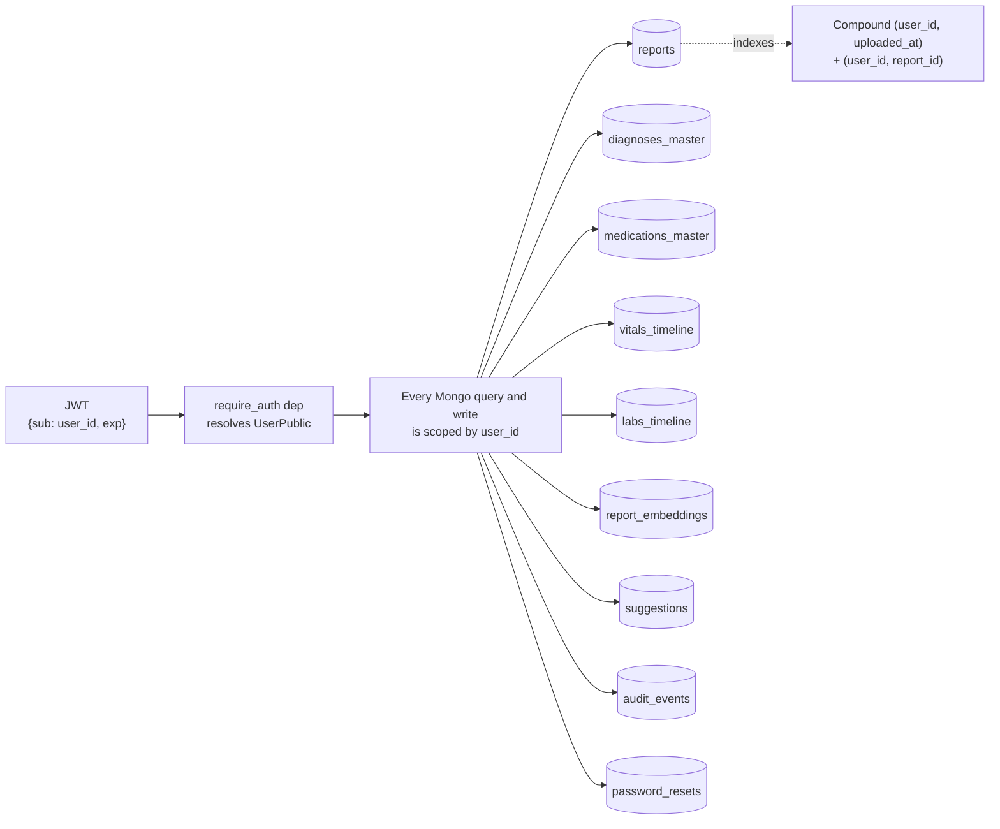

# Folio

A personal medical-record companion. Drop a PDF lab report, a phone photo of a paper visit summary, a voice memo about a symptom, or just type how you're feeling. Folio extracts structure, builds a longitudinal timeline, and answers questions about your own record in chat.

The way personal medical history works is broken. The actual data of your care lives in PDFs in your downloads folder, photos in your camera roll, and notes in your phone. Nothing talks to anything. Every new clinic re-asks the same questions. Folio takes that mess seriously: one schema, one timeline, one place to ask.

Multi-user. Sign up with a username plus password and your record is partitioned from every other user's. Runs locally on Docker. Deploys to permanent free tiers. Explicitly not a medical device.

Live: [folio-health.vercel.app](https://folio-health.vercel.app)

---

## Architecture

### Deployment topology



### Request flow on a single chat turn



### Ingest pipeline (text / PDF / image / voice)



### Per-user data partitioning



---

## What's interesting

A few specific things worth talking through, with code locations.

### Streaming JSON parsed mid-stream
The hot-path extraction model streams JSON tokens over SSE. The frontend walks the partial buffer, tracks brace and bracket depth, and closes any open structures so it can render complete-looking nested objects mid-stream. Diagnoses appear on screen in ~700ms while the full extraction is still being generated.
`frontend/src/lib/partialJson.ts`, `backend/app/routers/ingest.py`.

### Safer hot-path by default
Extraction defaults to Claude Sonnet 4.5 (5.8 percent hallucination on value-bearing fields per the live eval) rather than Haiku (13.1 percent). Haiku stays as the same-provider fallback so a Sonnet outage doesn't kill the app. Override with `EXTRACT_SAFE_MODE=false` for bulk workloads where latency beats accuracy.
`backend/app/config.py`, `backend/app/models/router.py`.

### Multi-LLM consensus by vector alignment, not LLM debate
Flipping the composer to "High-conf" runs Sonnet, GPT-4.1, and Gemini 2.5 Pro in parallel against the same input. For each field of the schema I embed every model's output, cluster items by cosine similarity (threshold 0.78), and pick clusters where at least two of three providers agree. Per-field confidence is `unique_providers / models_succeeded`. Vector alignment is cheaper than a reflection round and immune to the correlated-failure pattern where all three confidently agree on the same hallucination.
`backend/app/pipeline/consensus.py`.

### RAG over your own record
Every report is embedded on ingest (text-embedding-3-small, cached in Redis). On every chat turn the user's message is embedded, top-k passages are pulled via brute-force cosine (about 10ms for fewer than 1000 reports; swap for pgvector when that breaks), and the matched passages are injected into the system prompt as cited evidence. The UI renders citation chips under each reply that deep-link back to the source report. The model cannot fabricate "your last A1C was X" if X is not in retrieved context.
`backend/app/rag/`, `backend/app/routers/chat.py`.

### Drug interactions never go through the LLM
A curated table of 60+ clinically-important pairs (with brand-name aliases like Xanax to alprazolam, Lipitor to atorvastatin) does the lookup. The LLM only phrases the result for the user. Live eval: 100 percent precision, 100 percent recall on 17 hand-authored cases.
`backend/app/suggestions/interactions.py`.

### Three safety layers on chat
A system-prompt boundaries block (you are not a doctor, no diagnoses, no dose changes), a per-message footer on every assistant reply, and a first-visit modal that requires acknowledgement. Red-flag escalation (chest pain, stroke symptoms, anaphylaxis, suicidal thoughts, sudden vision loss) routes the model to "Call 911 or go to the ER now" instead of a chat response.
`backend/app/routers/chat.py`, `frontend/src/pages/Chat.tsx`.

### Privacy and user control
Self-service data export (JSON dump of every per-user document across 9 collections), account deletion with username-confirmation gate, audit log of sensitive actions (chat queries, report views, exports) with a 180-day TTL. All visible on the Profile page.
`backend/app/routers/me.py`, `backend/app/audit.py`, `frontend/src/pages/Profile.tsx`.

### Retries with backoff on every LLM call
A small `with_retries` helper wraps Anthropic and OpenAI clients. Transient errors (408, 425, 429, 5xx, network resets) retry up to 3 times with jittered exponential backoff capped at 4 seconds. Mid-stream failures are not retried (no duplicate output) but still trigger the fallback model.
`backend/app/retry.py`.

### Per-user rate limits backed by Redis
Chat 20/min and 400/day, ingest 10/min and 80/day, consensus 4/min and 20/day, vision 6/min and 40/day. Atomic INCR with TTL keys. Fails open if Redis is unreachable.
`backend/app/ratelimit.py`.

### Hot path vs cold path
The user-facing latency budget contains only what's on the critical path: PII scrub, cache check, LLM extraction, persist. Suggestions, embeddings, risk scores, and the cold-path differential-diagnosis Claude call run after the response is closed via `asyncio.create_task`. First field on screen under 1 second, full extraction under 2.5 seconds, suggestions inbox fills 5 to 10 seconds later.
`backend/app/routers/ingest.py::_pipeline`.

### Vision-clinical, not OCR, for photos
Image ingest used to OCR text. That's useless for a clinical photo of a skin lesion or eye. Now Claude Sonnet's vision pass produces the unified schema directly: `symptoms` get visible observations (location, distribution, borders, signs of inflammation), `red_flags` get concerning features, and the summary gives hedged differential considerations. Never "this is X" : always "consistent with X".
`backend/app/models/router.py::vision_clinical_extract`.

For the full design tour (bottlenecks, trade-offs, what I'd build next, and how this maps to a multi-LLM clinical-extraction pipeline) see [PROJECT_NOTES.md](./PROJECT_NOTES.md).

---

## Running it locally

```bash
git clone https://github.com/rishika1099/Folio-Clinical-Multimodal-RAG
cd Folio-Clinical-Multimodal-RAG
cp .env.example .env        # drop your Anthropic key in
docker compose up --build
```

App at http://localhost:5173. API docs at http://localhost:8000/docs.

The app starts empty. Add a report from chat (drop a file or paste a report) and the overview, timeline, and suggestions populate as you go. For a screencast or a demo without using your own data, `docker compose exec backend python -m app.seed` writes 14 synthetic reports across 10 months.

### Environment keys

| Env var | Required? | What for |
|---|---|---|
| `ANTHROPIC_API_KEY` | yes | hot-path extraction (Claude Sonnet) and chat reasoning |
| `OPENAI_API_KEY`    | optional | voice transcription (Whisper), embeddings, fallback extraction |
| `GEMINI_API_KEY`    | optional | vision OCR for scanned PDFs |
| `JWT_SECRET`        | recommended | long random string used to sign session tokens. Generate with `python -c "import secrets; print(secrets.token_urlsafe(64))"`. |
| `ALLOW_SIGNUP`      | optional | `true` (default) lets anyone register. Switch to `false` once your trusted users are in. |
| `CORS_ORIGINS`      | recommended | comma-separated list of origins allowed to call the API. Lock to your Vercel URL in production. |
| `EXTRACT_SAFE_MODE` | optional  | `true` (default) routes extraction through Sonnet 4.5 for low hallucination. `false` reverts to Haiku-first for speed. |
| `RESEND_API_KEY`    | optional | Resend transactional-email key. If missing, password-reset links log to stdout instead of email. |
| `APP_URL`           | optional | absolute URL used in password-reset email links. Defaults to the production Vercel domain. |
| `EMAIL_FROM`        | optional | "From" header for outgoing email. |

See [DEPLOY.md](./DEPLOY.md) for the free-tier hosting walkthrough (Render, Vercel, Mongo Atlas, Upstash).

---

## Stack

FastAPI (async). Motor (async Mongo). Redis. GridFS for original-file storage. React, Vite, Tailwind. Recharts. Server-sent events for streaming.

Frontend, backend, Mongo, and Redis each run as their own container under `docker compose`. Production deploys to Render (web service) plus Vercel (static) plus Atlas (M0) plus Upstash (Redis), all on permanent free tiers (with paid upgrades available for backups and zero cold-start).

## Eval

See [EVAL_REPORT.md](./EVAL_REPORT.md) for the live numbers (cross-vendor extraction head-to-head, multi-LLM consensus, chat groundedness, drug-interaction safety net, latency, PII).

Headline:

- Sonnet 4.5 hot-path: 5.8 percent hallucination on doses and lab values
- RAG: 100 percent recall@1, MRR 1.000, NDCG@10 0.970
- Chat groundedness: 100 percent answer / 100 percent citation / 100 percent red-flag escalation / 100 percent hallucination guard on 14 live probes
- Drug interactions: 100 percent precision / 100 percent recall / 100 percent F1 on 17 cases against the curated DB
- PII scrub recall 100 percent across 6 classes
- PII scrub p50 0.065 ms, cosine search over full corpus p50 2.3 ms

---

## Licence

Copyright © 2026 Rishika Mamidibathula. All rights reserved. See [LICENSE](./LICENSE). Published for portfolio review only. Not licensed for use, copying, redistribution, or as ML training data.
